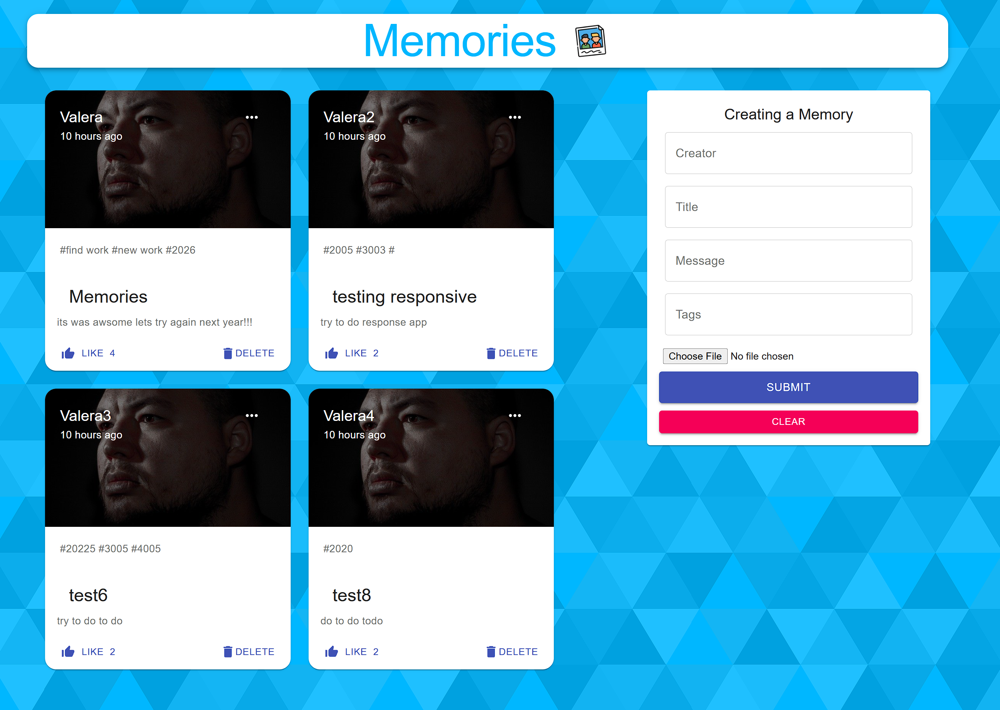
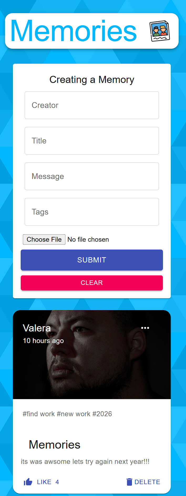

```markdown
# Memories

[](https://nodejs.org/)
[](https://reactjs.org/)
[](https://www.mongodb.com/)


## About the Project

**Memories** is an educational/portfolio project built with the MERN stack (MongoDB, Express, React, Node.js). It's a simple feed of "memories/posts" where users can create, read, update, and delete posts with images, titles, text, tags, and likes. Key features include CRUD operations for posts, liking functionality, relative time display using Moment.js, image previews via Base64 encoding, a Material-UI interface, Redux for state management, and Redux-Thunk for handling side effects. This serves as an excellent template for blog or feed-based applications and demonstrates full-stack development skills, making it ideal for learning or showcasing in a portfolio.

## Table of Contents

- [About the Project](#about-the-project)
- [Screenshots](#screenshots)
- [Tech Stack and Dependencies](#tech-stack-and-dependencies)
- [Repository Structure](#repository-structure)
- [Data Model (Mongoose)](#data-model-mongoose)
- [API](#api)
- [Environment Variables](#environment-variables)
- [Installation and Local Setup](#installation-and-local-setup)
- [NPM Scripts](#npm-scripts)
- [Deployment](#deployment)
- [Common Issues and Solutions (FAQ)](#common-issues-and-solutions-faq)
- [Roadmap](#roadmap)
- [Contributing](#contributing)
- [License](#license)
- [Acknowledgments](#acknowledgments)
- [Contacts](#contacts)

## Screenshots

## Screenshots





## Tech Stack and Dependencies

- **Frontend:** React, Redux, Redux-Thunk, Material-UI (v4, @material-ui/core, @material-ui/icons), Axios, Moment.js, react-file-base64.
- **Backend:** Node.js, Express, Mongoose, CORS.
- **Database:** MongoDB Atlas.
- **Other:** .env for configuration, monorepo structure with `client/` and `server/`.

## Repository Structure

Here's an overview of the project folder structure:

```
memories/
├── client/                    # Frontend (React)
│   ├── src/
│   │   ├── actions/           # Redux actions (getPosts, createPost, updatePost, deletePost, likePost)
│   │   ├── api/               # Axios instance/functions
│   │   ├── components/
│   │   │   ├── Form/
│   │   │   └── Posts/
│   │   │       └── Post/
│   │   ├── reducers/          # Posts reducer
│   │   ├── App.js
│   │   └── index.js
│   └── package.json
├── server/                    # Backend (Express)
│   ├── controllers/           # posts.js (getPosts, createPost, updatePost, deletePost, likePost)
│   ├── models/                # postMessage.js (Mongoose schema)
│   ├── routes/                # posts.js (routes /api/posts)
│   ├── index.js               # Server entry point, serves frontend from client/build
│   └── package.json
├── .env.example               # Example configuration
├── README.md
└── package.json (optional)
```

## Data Model (Mongoose)

The `PostMessage` schema defines the structure of each post in MongoDB. It includes fields for title, message, creator, tags, image (as Base64), like count, and creation timestamp.

Example schema:

```js
{
  title: String,
  message: String,
  creator: String,
  tags: [String],
  selectedFile: String,      // Base64-encoded image string
  likeCount: { type: Number, default: 0 },
  createdAt: { type: Date, default: new Date() }
}
```

## API

The backend provides a RESTful API for managing posts. All endpoints are prefixed with `/api/posts`.

| Method | Path                      | Description             | Body/Response                                   |
|--------|---------------------------|-------------------------|-------------------------------------------------|
| GET    | `/api/posts`              | Get all posts           | 200 -> Array of posts                           |
| POST   | `/api/posts`              | Create a post           | Body: {title, message, creator, tags, selectedFile} -> 201 -> New post |
| PATCH  | `/api/posts/:id`          | Update a post           | Body: Partial update -> 200 -> Updated post     |
| DELETE | `/api/posts/:id`          | Delete a post           | 200 -> { id }                                   |
| PATCH  | `/api/posts/:id/likePost` | Increment like count    | 200 -> Updated post                             |

Example request/response (POST /api/posts):

Request Body:
```json
{
  "title": "My Memory",
  "message": "A great day!",
  "creator": "John Doe",
  "tags": ["fun", "adventure"],
  "selectedFile": "data:image/jpeg;base64,/9j/4AAQSkZJRgABAQAAAQABAAD..."
}
```

Response:
```json
{
  "_id": "60d5ecb74b4e4a001f8e4b12",
  "title": "My Memory",
  "message": "A great day!",
  "creator": "John Doe",
  "tags": ["fun", "adventure"],
  "selectedFile": "data:image/jpeg;base64,/9j/4AAQSkZJRgABAQAAAQABAAD...",
  "likeCount": 0,
  "createdAt": "2023-06-25T12:00:00.000Z"
}
```

## Environment Variables

Environment variables are managed via a `.env` file in the `server/` directory. The repository includes a `.env.example` file—copy it to `.env` and fill in the values.

Example `.env`:

```
# server/.env
PORT=5000
MONGODB_URI=mongodb+srv://<user>:<pass>@<cluster>/<db>?retryWrites=true&w=majority
# If frontend and backend are on different domains, add:
CLIENT_ORIGIN=http://localhost:3000
```

To get `MONGODB_URI`:
1. Create a MongoDB Atlas account and cluster.
2. Go to your cluster > Connect > Drivers.
3. Copy the connection string and replace `<user>`, `<pass>`, `<cluster>`, and `<db>` with your details.
4. In Atlas > Network Access, add your IP (for testing, use 0.0.0.0/0, but note this is insecure for production).

## Installation and Local Setup

### Prerequisites

- Node.js LTS, npm or pnpm.
- MongoDB Atlas account with a created cluster.

### First-Time Setup

```bash
git clone <your-repository-url>
cd memories

# Copy and fill server/.env based on .env.example

# Install dependencies for frontend and backend
cd client && npm install
cd ../server && npm install

# Start backend (Express) in dev mode (open a terminal):
cd server
npm start  # Or npm run dev if using Nodemon

# In another terminal, start frontend:
cd ../client
npm start
```

By default:
- Frontend: `http://localhost:3000`
- Backend API: `http://localhost:5000/api`

The app can run as separate services (client/server) or as a single service where Express serves the frontend.

### Building and Serving Frontend via Server

In production, Express serves static files from `client/build` and routes non-API paths to `index.html`:

```js
// server/index.js
import path from 'path';
app.use(express.static(path.join(__dirname, '../client/build')));
app.get('*', (req, res) => {
  if (req.path.startsWith('/api')) return res.status(404).send('Not Found');
  res.sendFile(path.join(__dirname, '../client/build', 'index.html'));
});
```

## NPM Scripts

**client/package.json**

```json
{
  "scripts": {
    "start": "react-scripts start",
    "build": "react-scripts build",
    "test": "react-scripts test"
  }
}
```

**server/package.json**

```json
{
  "type": "module",
  "scripts": {
    "start": "node index.js",
    "dev": "nodemon index.js",
    "build:client": "cd ../client && npm ci && npm run build"
  }
}
```

## Deployment

### Option A: Render (Web Service, Free Tier Available)

1. Push code to GitHub.
2. In Render > New > Web Service > Connect repo.
3. Root Directory: `server`.
4. Build Command: `npm ci && npm run build:client`
5. Start Command: `npm start`
6. Environment Variables: `MONGODB_URI=...`, `NODE_ENV=production` (optional).
7. After build, the app runs on one URL with frontend and API together.

### Option B: Heroku (Requires Credit Card for Verification)

1. `heroku create`
2. Set variables: `heroku config:set MONGODB_URI=...`
3. Configure client build via `build:client` script.
4. `git push heroku main`

## Common Issues and Solutions (FAQ)

- `ERR_CONNECTION_REFUSED`: Server not running or invalid `MONGODB_URI`.
- `Could not connect to any servers in your MongoDB Atlas cluster`: IP not whitelisted (Atlas > Network Access).
- Material-UI icon errors: Ensure `@material-ui/core` and `@material-ui/icons` are installed and versions match.
- Frontend can't reach backend locally: Check Axios proxy/base URL; use relative paths (`/api/...`) if server serves frontend.

## Roadmap

- Authentication with JWT.
- Comments on posts.
- Pagination and tag-based search.
- Image uploads to cloud storage instead of Base64.

## Contributing

Feel free to open issues or submit pull requests. Follow standard GitHub flow: fork, branch, commit, PR.


## Acknowledgments

Inspired by various MERN tutorials and resources for educational purposes.

## Contacts

Author: [Valeriy Gordienko]([https://github.com/<your-gh>](https://github.com/Valeras17/memories-mern.git)) • 

This project is free for personal learning, skill demonstration, and portfolio use. It was developed as part of a learning exercise.
```
